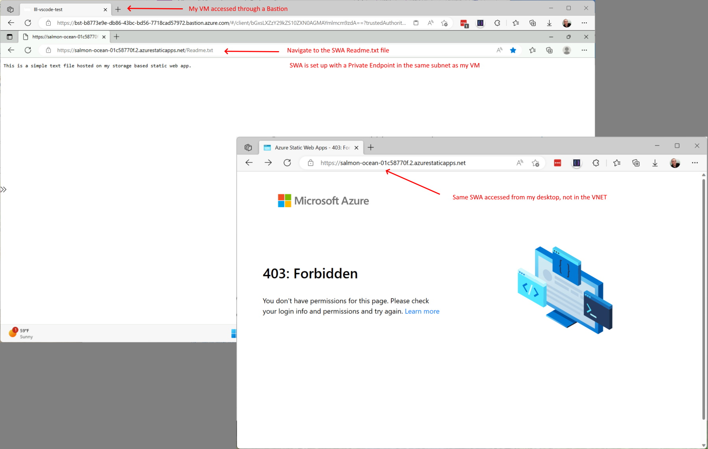

# Private Static Web App Example

This repo contains a simple static web app that is design to only allow access from an internal VNET. I started the app with the quick start example below, then stripped it down to just a basic HTML and Readme.txt file.  This was deployed to a Azure Static Web App

After it was deployed, I was able to access it publicly from anywhere.

In order to lock it down, I created a private endpoint for the SWA, which meant that I had to upgrade the app from Basic to Standard. Once it was updated I then created a private endpoint in a VNET where I had an existing VM that I could test with via a Bastion host.

Once the PE was created, I was able to access the app from the VM, but not from anywhere else.

*Note: As this was a very quick POC, this example does not have any Bicep or Pipelines yet. When you use the VS Code SWA extension, it prompts you and creates the Azure resources automatically.*

---

## References

[Azure Static Web Apps](https://docs.microsoft.com/azure/static-web-apps/overview)

[Static Web App Quick Start](https://docs.microsoft.com/azure/static-web-apps/getting-started?tabs=vanilla-javascript)

[VS Code SWA Extension](https://marketplace.visualstudio.com/items?itemName=ms-azuretools.vscode-azurestaticwebapps)

[Configuring a Private Endpoint in SWA](https://learn.microsoft.com/en-us/azure/static-web-apps/private-endpoint)

[SWA Workflow Configuration Reference](https://aka.ms/swaworkflowconfig)
